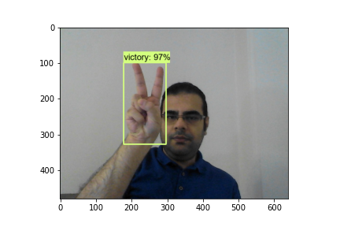

# Hand Sign Detection via TensorFlow		

This project needs user to follow instructions precisely to run. Thus I recommend users to read the README and the comments of 
the jupyter notebook (especially *hsd_tf_packages.ipynb*)  to run the project successfully.

I highly recommend running the project on a Python Virtual Environment.
I put two versions of the code. One with all the needed packages pip installation nested in the 
ipynb file of the kernel *hsd_tf_packages.ipynb*. And another with just import commands. The second version 
is for the second implementation and tuning.
If you run it for the first time, you should follow the comments precisely. Sometimes a package 
needs couple of installs in order to be fully installed on the environment.  
I didn't use a GPU to train my network. If you want to do that you should also download and utilize 
a cuDNN and CUDA library compatible with the downloaded TensorFlow. In the package's website, 
you can find the compatible versions' names.

## Using the labeling Data Tool

This section explain how to use the data tool in order to label the collected images in data loading phase.
1. After cloning the tool from github, run its next cell consisting below codes:

  * *!cd {lab_tool_dir} && pyrcc5 -o libs/resources.py resources.qrc*
  * *!cd {lab_tool_dir} && python labelImg.py*

&nbsp;&nbsp;&nbsp;  As a result the tool will be accessible on the Windows taskbar.

2. Bring it up and from its leftside menu click on the *Open Dir* button

3. Go to the images folder (in my path setup 'unlabeled_imgs')

4. Go to each image group (label) folders

5. Select the folder 
  * Sometimes the tool asks you to select the folder again, if the images
can be seen in the right side menu (second one), you're good to go.

6. Choose each image in the folder (First one is chosen already)

7. Click 'w' then choose the object (signed hand) entirely
  * Try to encompass it as tight as possible
  * If anything went wrong, you can change the chosen area after naming the label
  * Note the labels name, they will be used in the project training and testing phase

&nbsp;&nbsp;&nbsp; I named my labels as: like, dislike, victory, hi

8. ctrl + s

9. Choose the next image and reapeat the phases 7 and 8

10. Do that for all the image folders

11. Make two folders in *'all_images'* folder namely *'img_train'* and *'img_test'* 

12. For each label you can choose 80% of your all photos for training ('img_train'),
and the remaining for testing ('img_test')

&nbsp;&nbsp;&nbsp; **IMPORTANT** Choose each image with its corresponding xml file (labeled one).
  * Thus if you have taken 20 photos, you will have 32 files in your *'img_train'* folder
and 8 files in the *'img_test'*.

13. After moving all the photos and their xml files, now you can delete the 'unlabeled_imgs' folder.

## Installing TensorFlow and Approving its Installation

This is a very important and sometimes tedious part in the pretraining phase, thus be patient.
We should install the tensorflow after cloning it following specified cells.

*approved_installation* The cell which begins with this variable can be run in 
order to make sure that installation went well.

**WHY THERE ARE SEVERAL CELLS UNDER THE approved_installation CELL**                                                  
Each time that user runs the approved_installation cell, it may return an error
saying that some module is not installed. These several cells following approved_installation 
instructions to install all the needed packages properly.

**IMPORTANT** Someimes you get one error one skipped from the approved_installation result, 
in this case, if the *'import object_detection'* command went well, you are most probably good to go.

**IMPORTANT** Before running the *'import object_detection'* command, you may have to restart the Kernel.

## Downloading the Pretrained Model

Right after installing the TensorFlow and the importing of *object detection*, there is a cell
which downloads a pretrained model as our underlying model to develop upon. The cell is fully 
commented out (including the executable commands) because I could not open the official link. 
For whom with the same issue, I will upload the ssd_mobilenet_v2_fpnlite_320x320_coco17_tpu-8
model in a different repository on my github. So users can download directly or clone it in your code.

*https://github.com/demianAdli/object_detection_pretrained_model*
